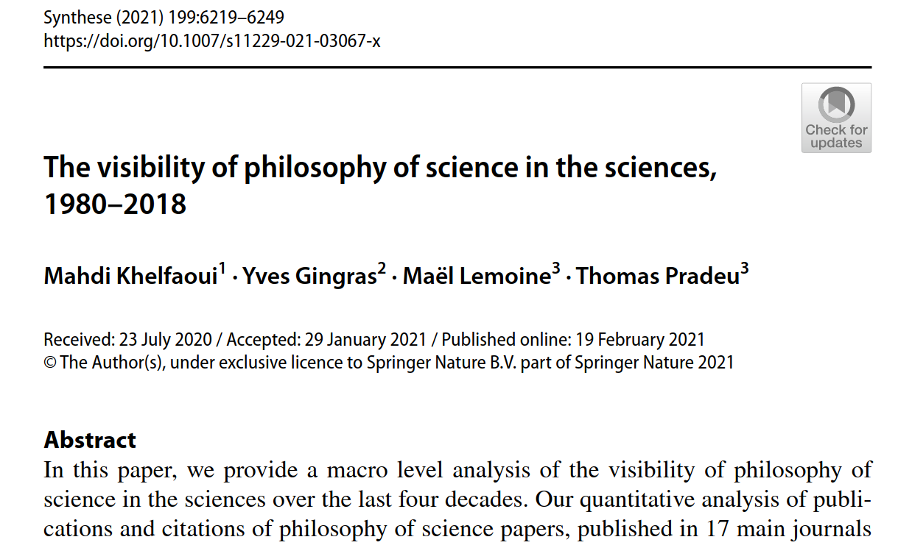
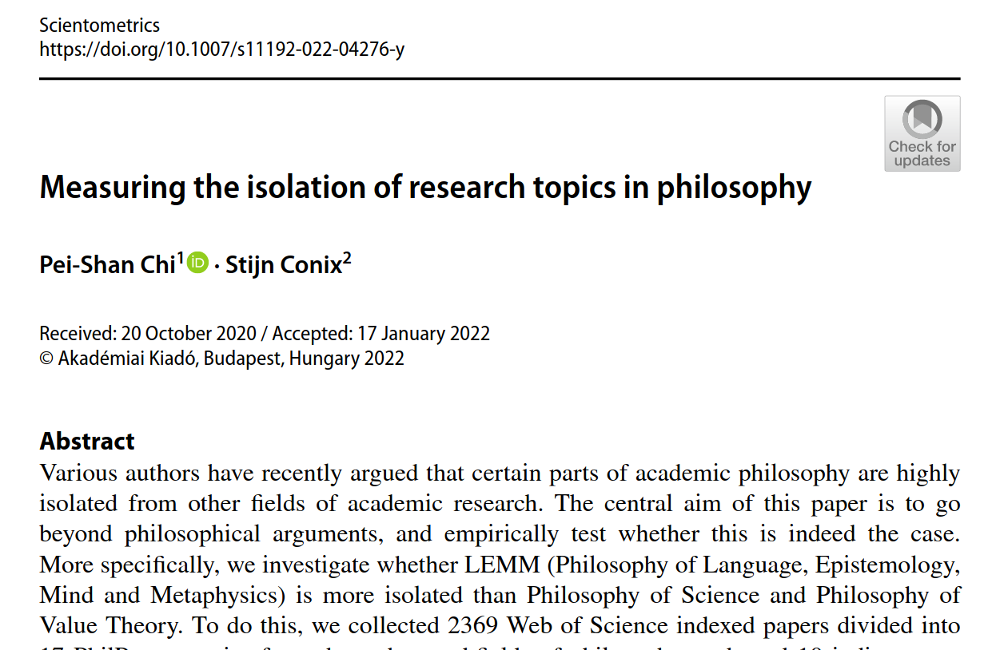
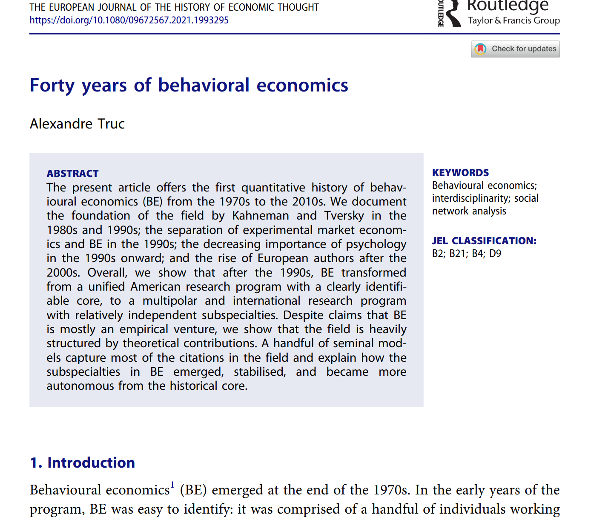
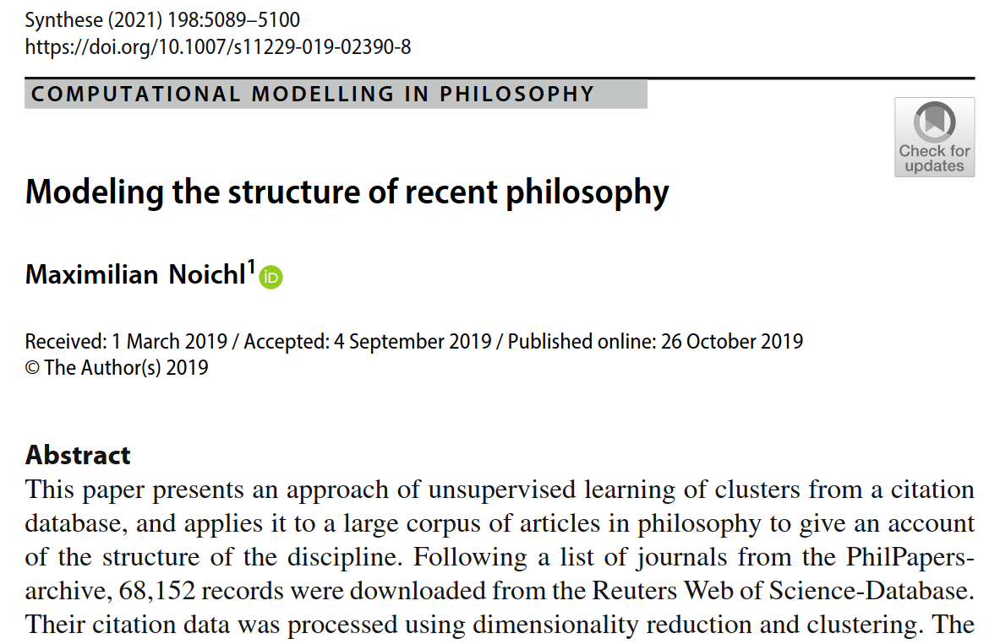
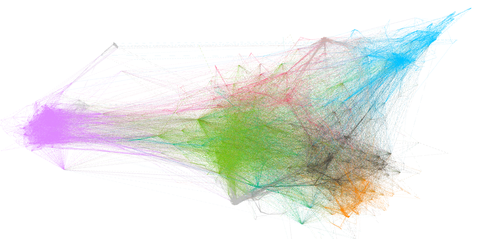
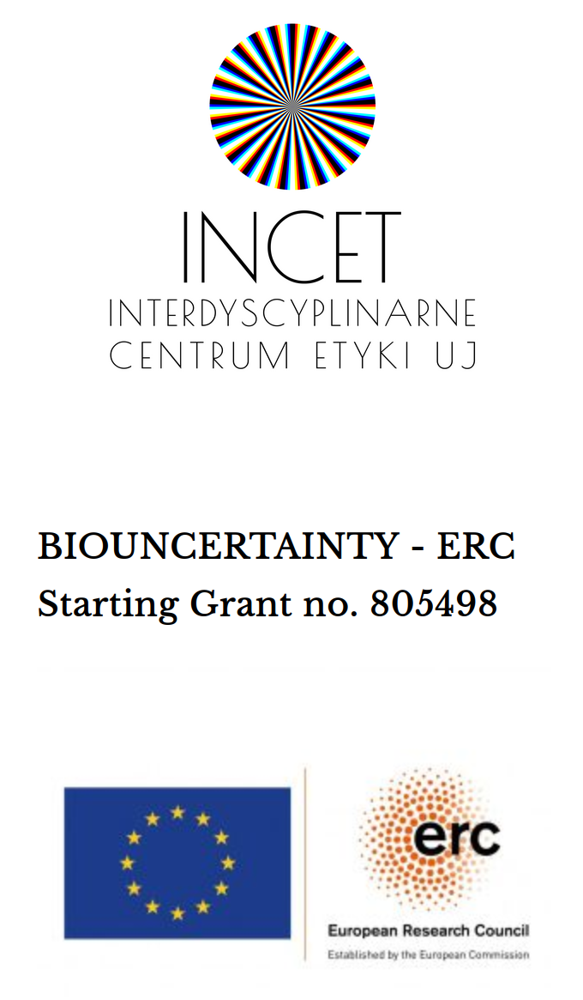

class: title-slide-custom


# Who cares about legal philosophy? <br /> What do legal philosophers care about?
## A co-citation analysis

.bottom[
.title-author[**Piotr Bystranowski**]

.title-author[Interdisciplinary Centre for Ethics <br /> Jagiellonian University] <br /><br />
.title-bottom[July 8th, 2022<br />IVR World Congress<br />SW 28]]
---
class: inverse
# (Co-)citation networks


--

.ex1[]

--

.ex2[]

--

.ex3[]

--

.ex4[]

---
.left-column[# Project]
.right-column[
.list1[
- Based on a network of co-citations:

.list2[
    
  * to identify the core of contemporary philosophy of law,
* to delineate its main areas of research, and
* to describe its structure.]

- To analyse the degree to which different areas interact with each other.
- To analyse the degree to which different areas are cited outside the philosophy of law.
]

.bottom[**Data source**: *openalex.org* (but also *philpapers.org* i *SCOPUS*)]
]

---
background-image: url(https://upload.wikimedia.org/wikipedia/commons/b/be/Sharingan_triple.svg)

```{r setup, include=FALSE}
options(htmltools.dir.version = FALSE, htmltools.preserve.raw = FALSE)
```

???

Image credit: [Wikimedia Commons](https://commons.wikimedia.org/wiki/File:Sharingan_triple.svg)

---
class: inverse, center, middle

# The set of texts <br> and <br> constructing the graph


---
.left-column[
# Problem ]

.right-column[<br><br>
**The standard way**: *start with texts published in journals from a given area*. <br><br>


**But**: <br>
.list2[
    * important texts in legal philosophy are often published outside specialist journals;
* key texts in legal philosophy are often books.
]]
<br>

--

.right-column[
**Alternative approach**:
.list2[
    * start with texts published in specialist journals *or* classified in *philpapers.org*;
* add most cited or citing articles;
* based on patterns of co-citations, identify the core of such a collection.
]]
{{content}}

---

# Procedure


```{r flowchart, fig.width=12, echo=FALSE}
source("../src/flowchart.R")
flowchart
```

---

# Graph
.graph[
```{r, echo=FALSE, out.width="150%"}
  
```
]

---
class: inverse, center, middle
# Detection <br>and interpretation of <br>communities

---

.left.column[# Detection <br>and interpretation of <br>communities]
.right-column[Detecting communities using the Louvain algorithm.

(Out of many possible partitions, choose the most adequate/interesting)

26 communities (between 2 and 367 members), including 19 interpreted ones.

Interpreting communities:
.list2[
    + analysing of characteristic words from titles and abstracts (*tf-idf*)
+ analysing the most "prestigious" members (*eigenvector centrality*)
]]

---

# Argumentation
.left_panel[
```{r, message=FALSE, echo=FALSE}
library(kableExtra)
source("../src/functions/labelClust.R")
nodes <- read.csv("../data/cits/nodes.csv") %>% labelClusts()
edges <- read.csv("../data/cits/edges.csv")
works <- read.csv("../data/raw/works_full.csv")
source("../src/functions/subgraphCentrality.R")
#DT::datatable(subgraphCentrality(0),
#  fillContainer = T, options = list(pageLength = 8))
knitr::kable(subgraphCentrality(0), format = 'html') %>% kable_styling(font_size = 12)
```
]

.right_top_panel[
*N* = `r nodes %>% filter(Modularity.Class == 0) %>% nrow()`
]

.right_bottom_panel[
```{r, message=F, echo=F}
tokenized <- read.csv("../data/text/tokenized.csv")
source("../src/graph_analysis.R")
tf_idf(0)
```
]
---
# General jurisprudence
.left_panel[
```{r, message=FALSE, echo=FALSE}
k=12
knitr::kable(subgraphCentrality(k), format = 'html') %>% kable_styling(font_size = 12)
```
]

.right_top_panel[
*N* = `r nodes %>% filter(Modularity.Class == k) %>% nrow()`
]

.right_bottom_panel[
```{r, message=F, echo=F}
tf_idf(k)
```
]
---
# Punishment / Responsibility
.left_panel[
```{r, message=FALSE, echo=FALSE}
k=11
knitr::kable(subgraphCentrality(k), format = 'html') %>% kable_styling(font_size = 12)
```
]

.right_top_panel[
*N* = `r nodes %>% filter(Modularity.Class == k) %>% nrow()`
]

.right_bottom_panel[
```{r, message=F, echo=F}
tf_idf(k)
```
]
---
# Justice and fairness
.left_panel[
```{r, message=FALSE, echo=FALSE}
k=9
knitr::kable(subgraphCentrality(k), format = 'html') %>% kable_styling(font_size = 12)
```
]

.right_top_panel[
*N* = `r nodes %>% filter(Modularity.Class == k) %>% nrow()`
]

.right_bottom_panel[
```{r, message=F, echo=F}
tf_idf(k)
```
]
---
# Global justice
.left_panel[
```{r, message=FALSE, echo=FALSE}
k=2
knitr::kable(subgraphCentrality(k), format = 'html') %>% kable_styling(font_size = 12)
```
]

.right_top_panel[
*N* = `r nodes %>% filter(Modularity.Class == k) %>% nrow()`
]

.right_bottom_panel[
```{r, message=F, echo=F}
tf_idf(k)
```
]
---
# Private law / Legal realism and descendants
.left_panel[
```{r, message=FALSE, echo=FALSE}
k=7
knitr::kable(subgraphCentrality(k), format = 'html') %>% kable_styling(font_size = 12)
```
]

.right_top_panel[
*N* = `r nodes %>% filter(Modularity.Class == k) %>% nrow()`
]

.right_bottom_panel[
```{r, message=F, echo=F}
tf_idf(k)
```
]
---
# Constitutionalism / Legal pluralism 
.left_panel[
```{r, message=FALSE, echo=FALSE}
k=5
knitr::kable(subgraphCentrality(k), format = 'html') %>% kable_styling(font_size = 12)
```
]

.right_top_panel[
*N* = `r nodes %>% filter(Modularity.Class == k) %>% nrow()`
]

.right_bottom_panel[
```{r, message=F, echo=F}
tf_idf(k)
```
]
---
# Criminal law
.left_panel[
```{r, message=FALSE, echo=FALSE}
k=19
knitr::kable(subgraphCentrality(k), format = 'html') %>% kable_styling(font_size = 12)
```
]

.right_top_panel[
*N* = `r nodes %>% filter(Modularity.Class == k) %>% nrow()`
]

.right_bottom_panel[
```{r, message=F, echo=F}
tf_idf(k)
```
]
---
# Law and political theory
.left_panel[
```{r, message=FALSE, echo=FALSE}
k=6
knitr::kable(subgraphCentrality(k), format = 'html') %>% kable_styling(font_size = 12)
```
]

.right_top_panel[
*N* = `r nodes %>% filter(Modularity.Class == k) %>% nrow()`
]

.right_bottom_panel[
```{r, message=F, echo=F}
tf_idf(k)
```
]
---
# Natural law and non-positivism
.left_panel[
```{r, message=FALSE, echo=FALSE}
k=8
knitr::kable(subgraphCentrality(k), format = 'html') %>% kable_styling(font_size = 12)
```
]

.right_top_panel[
*N* = `r nodes %>% filter(Modularity.Class == k) %>% nrow()`
]

.right_bottom_panel[
```{r, message=F, echo=F}
tf_idf(k)
```
]
---
# International (criminal) law
.left_panel[
```{r, message=FALSE, echo=FALSE}
k=1
knitr::kable(subgraphCentrality(k), format = 'html') %>% kable_styling(font_size = 12)
```
]

.right_top_panel[
*N* = `r nodes %>% filter(Modularity.Class == k) %>% nrow()`
]

.right_bottom_panel[
```{r, message=F, echo=F}
tf_idf(k)
```
]
---
# Expert systems
.left_panel[
```{r, message=FALSE, echo=FALSE}
k=13
knitr::kable(subgraphCentrality(k), format = 'html') %>% kable_styling(font_size = 12)
```
]

.right_top_panel[
*N* = `r nodes %>% filter(Modularity.Class == k) %>% nrow()`
]

.right_bottom_panel[
```{r, message=F, echo=F}
tf_idf(k)
```
]
---
# New theories and reinterpretations
.left_panel[
```{r, message=FALSE, echo=FALSE}
k=20
knitr::kable(subgraphCentrality(k), format = 'html') %>% kable_styling(font_size = 12)
```
]

.right_top_panel[
*N* = `r nodes %>% filter(Modularity.Class == k) %>% nrow()`
]

.right_bottom_panel[
```{r, message=F, echo=F}
tf_idf(k)
```
]
---
# Promising and reasonableness
.left_panel[
```{r, message=FALSE, echo=FALSE}
k=21
knitr::kable(subgraphCentrality(k), format = 'html') %>% kable_styling(font_size = 12)
```
]

.right_top_panel[
*N* = `r nodes %>% filter(Modularity.Class == k) %>% nrow()`
]

.right_bottom_panel[
```{r, message=F, echo=F}
tf_idf(k)
```
]
---
# Classical natural law
.left_panel[
```{r, message=FALSE, echo=FALSE}
k=23
knitr::kable(subgraphCentrality(k), format = 'html') %>% kable_styling(font_size = 12)
```
]

.right_top_panel[
*N* = `r nodes %>% filter(Modularity.Class == k) %>% nrow()`
]

.right_bottom_panel[
```{r, message=F, echo=F}
tf_idf(k)
```
]
---
# Legal epistemology
.left_panel[
```{r, message=FALSE, echo=FALSE}
k=3
knitr::kable(subgraphCentrality(k), format = 'html') %>% kable_styling(font_size = 12)
```
]

.right_top_panel[
*N* = `r nodes %>% filter(Modularity.Class == k) %>% nrow()`
]

.right_bottom_panel[
```{r, message=F, echo=F}
tf_idf(k)
```
]
---
# Legal personhood
.left_panel[
```{r, message=FALSE, echo=FALSE}
k=18
knitr::kable(subgraphCentrality(k), format = 'html') %>% kable_styling(font_size = 12)
```
]

.right_top_panel[
*N* = `r nodes %>% filter(Modularity.Class == k) %>% nrow()`
]

.right_bottom_panel[
```{r, message=F, echo=F}
tf_idf(k)
```
]
---
# Free speech
.left_panel[
```{r, message=FALSE, echo=FALSE}
k=17
knitr::kable(subgraphCentrality(k), format = 'html') %>% kable_styling(font_size = 12)
```
]

.right_top_panel[
*N* = `r nodes %>% filter(Modularity.Class == k) %>% nrow()`
]

.right_bottom_panel[
```{r, message=F, echo=F}
tf_idf(k)
```
]
---
# Kant / Kelsen
.left_panel[
```{r, message=FALSE, echo=FALSE}
k=4
knitr::kable(subgraphCentrality(k), format = 'html') %>% kable_styling(font_size = 12)
```
]

.right_top_panel[
*N* = `r nodes %>% filter(Modularity.Class == k) %>% nrow()`
]

.right_bottom_panel[
```{r, message=F, echo=F}
tf_idf(k)
```
]
---

# Graph
.graph[
```{r, echo=FALSE, out.width="150%"}
  
```
]
---
class: inverse, center, middle
# Analysis of the graph
---

# Central texts

```{r, message=FALSE, echo=FALSE}
#library(DT)
nodes %>%
 left_join(works) %>%
 select(first_author, display_name, eigen, betweenness, cluster_label) %>%
 mutate_at(c("eigen", "betweenness"), round, 2) %>%
 arrange(desc(eigen)) %>%
DT::datatable(
 fillContainer = F, options = list(pageLength = 10), elementId = "DT")
```

---

# Central communities

```{r, message=FALSE, echo=FALSE}
#library(DT)
nodes %>%
  filter(!is.na(cluster_label)) %>% left_join(works, by = "id") %>% 
 group_by(cluster_label) %>% 
summarise(n = n(), year = round(mean(publication_year, na.rm=T)), eigen=mean(eigen, na.rm=T), betweenness=mean(betweenness,  na.rm=T))%>% 
 mutate_at(c("eigen", "betweenness"), round, 2) %>%
 arrange(desc(betweenness)) %>% 
DT::datatable(
 fillContainer = F, options = list(pageLength = 10), elementId = "DT2")
```

---

.no_margin[Isolation within the graph]

```{r, echo=FALSE}
cits <- read.csv("../data/raw/cits.csv") %>% 
  filter(work %in% nodes$id, cit %in% nodes$id) %>% 
  distinct(work, cit, .keep_all = T)
source("../src/in_cit_analysis.R")
```

.pull-left[.subttl[References]

```{r, echo=FALSE}
mean_citing %>% 
  knitr::kable() %>% 
  kable_styling(font_size = 10)
```

]

.pull-right[.subttl[Citations]
```{r, echo=FALSE}
mean_cited %>% 
  knitr::kable() %>% 
  kable_styling(font_size = 10)
```

]

---
# *Net* citations within the graph

```{r, echo=FALSE}
net_cits%>% 
  knitr::kable() %>% 
  kable_styling(font_size = 10)
```


---

# Geography

```{r, message=FALSE, echo=FALSE}

insts <- read.csv("../data/raw/insts_full.csv")
nodes %>% 
  filter(!is.na(cluster_label)) %>% 
  left_join(insts, by = c("id" = "item")) %>% 
  filter(!is.na(country_code)) %>% 
  group_by(cluster_label) %>% 
  summarize(US = mean(country_code == "US", na.rm=T),
            non_US_English = mean(country_code %in% c("GB", "CA", "AU", "NZ", "IE"), na.rm=T),
            other = mean(!country_code %in% c("GB", "CA", "AU", "NZ", "IE", "US"), na.rm=T)) %>% 
  mutate_at(c("US", "non_US_English", "other"), round, 2) %>% 
 DT::datatable(
 fillContainer = F, options = list(pageLength = 10), elementId = "DT3")
```


---

# Prestige of different types of publications

.pull-left[
```{r, message=FALSE, echo=FALSE}
nodes %>%
  left_join(works) %>%
  filter(!is.na(type)) %>%
  group_by(type) %>%
  summarize(n = n(), mean_eigen = round(mean(eigen, na.rm=T), 3)) %>%
  filter(n>20) %>%
  arrange(desc(mean_eigen)) %>% 
  knitr::kable() %>% kable_styling(font_size = 12)
 #DT::datatable(
 #fillContainer = F, options = list(pageLength = 10), elementId = "DT4")
```
]

--

.pull-right[
```{r, message=FALSE, warning=FALSE, echo=FALSE, fig.height=5}
nodes %>%
  left_join(works) %>%
  filter(publication_year>1960, cluster_label!="Argumentation") %>%
  filter(type %in% c("book", "journal-article")) %>%
  ggplot(aes(x=publication_year, y=eigen, color= type)) +
  geom_smooth(method = "lm")+
  #geom_point(alpha=0.4)+
  theme_minimal()
```
]

```{r, message=FALSE, warning=FALSE, echo=FALSE}
nodes %>%
  left_join(works) %>%
  filter(publication_year>1960) %>%
  filter(type %in% c("book", "journal-article")) %>%
  lm(eigen ~ type*publication_year, data = .) %>%
  broom::tidy() %>%
  mutate_at(c("estimate", "std.error", "statistic", "p.value"), round, 3) %>% 
   mutate(signif = gtools::stars.pval(p.value)) %>% 
  knitr::kable() %>% kable_styling(font_size = 12)
```

---
class: inverse, middle, center, hart
background-image: url("hart.jpeg")
background-size: contain
opacity: 0.5

# <h1 style="font-weight: bolder; text-shadow: -2px -2px 0 #000, 2px -2px 0 #000, -2px 2px 0 #000, 2px 2px 0 #000;">Who<br>cares about<br>philosophy of law?</h1>

---
.left-column[# Citations<br>from<br>outside the graph]

.right-column[work in progress

]

---

```{r, echo=FALSE, message=F}
read.csv("../data/cits/out_by_clust.csv") %>% 
  select(cluster, Philosophy.of.law, Law, Philosophy, Humanities, Social.sciences, Other) %>% 
  mutate_if(is.numeric, round, 2) %>% 
  DT::datatable(
 fillContainer = F, options = list(pageLength = 10), elementId = "DT4")
```
---
.left-column[
Conclusion
]
--
.right-column[
.question[
?
]
]

---
class: middle, center
.pull-left[
<br><br><br><br>
# Thank you!


github.com/bystry89/legal_philo<br><br><br>
bystry89.github.io/legal_philo/<br />slides/slides_IVR_08_07_2022.html
<br><br><br><br>
.xaringan[
Slides created via the R package [**xaringan**](https://github.com/yihui/xaringan).


The chakra comes from [remark.js](https://remarkjs.com), [**knitr**](https://yihui.org/knitr/), and [R Markdown](https://rmarkdown.rstudio.com).
]
]
.pull-right[
.image-right[
```{r echo = FALSE}

```
]]


